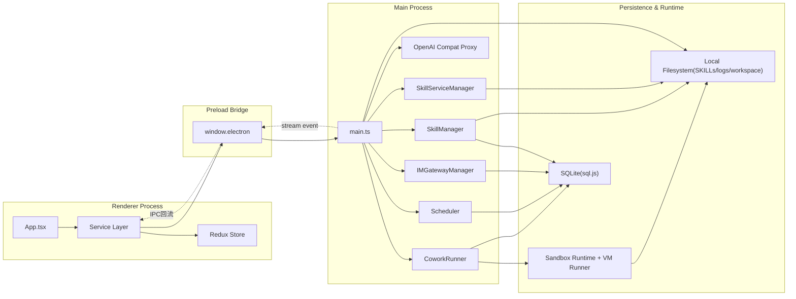
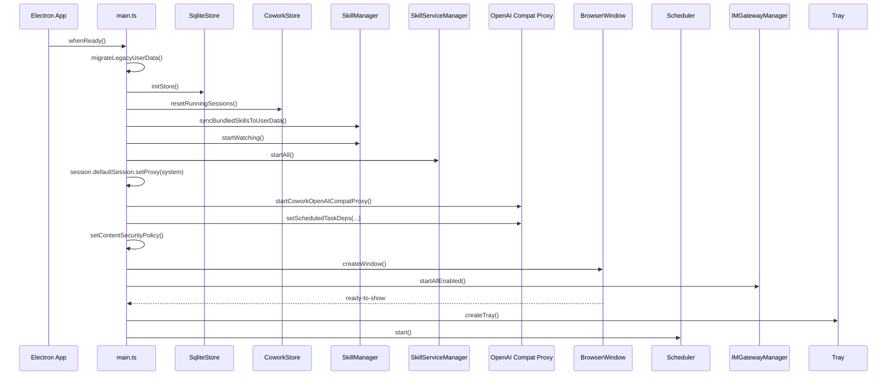
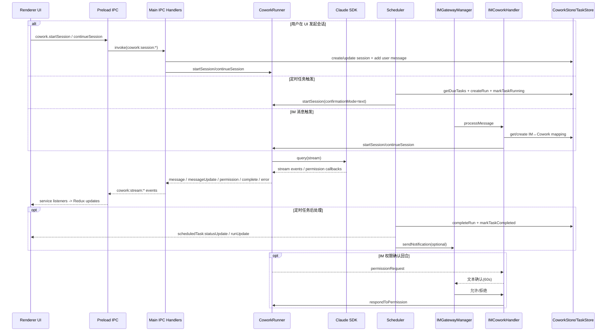

# LobsterAI 端到端架构深度分析（2026-02-20）

## 0. 分析说明

- 目标：基于代码事实，输出可直接用于技术评审和新人 onboarding 的端到端架构分析。
- 分析范围：Main / Preload / Renderer，及 Cowork、IM、Skills、Scheduled Tasks 四条核心业务链路。
- 事实基线：以仓库源码为准，未依据 README 做推断性补充。
- 本轮交付：仅文档分析，不修改任何代码和接口。

**事实锚点（核心入口）**

- `/Users/sugan/gitProjects/LobsterAI/src/main/main.ts`
- `/Users/sugan/gitProjects/LobsterAI/src/main/preload.ts`
- `/Users/sugan/gitProjects/LobsterAI/src/main/sqliteStore.ts`
- `/Users/sugan/gitProjects/LobsterAI/src/main/coworkStore.ts`
- `/Users/sugan/gitProjects/LobsterAI/src/main/libs/coworkRunner.ts`
- `/Users/sugan/gitProjects/LobsterAI/src/main/libs/coworkSandboxRuntime.ts`
- `/Users/sugan/gitProjects/LobsterAI/src/main/libs/coworkVmRunner.ts`
- `/Users/sugan/gitProjects/LobsterAI/src/main/scheduledTaskStore.ts`
- `/Users/sugan/gitProjects/LobsterAI/src/main/libs/scheduler.ts`
- `/Users/sugan/gitProjects/LobsterAI/src/main/im/imGatewayManager.ts`
- `/Users/sugan/gitProjects/LobsterAI/src/main/im/imCoworkHandler.ts`
- `/Users/sugan/gitProjects/LobsterAI/src/main/im/imStore.ts`
- `/Users/sugan/gitProjects/LobsterAI/src/main/skillManager.ts`
- `/Users/sugan/gitProjects/LobsterAI/src/main/skillServices.ts`
- `/Users/sugan/gitProjects/LobsterAI/src/renderer/main.tsx`
- `/Users/sugan/gitProjects/LobsterAI/src/renderer/App.tsx`
- `/Users/sugan/gitProjects/LobsterAI/src/renderer/store/index.ts`
- `/Users/sugan/gitProjects/LobsterAI/src/renderer/services/cowork.ts`
- `/Users/sugan/gitProjects/LobsterAI/src/renderer/services/scheduledTask.ts`
- `/Users/sugan/gitProjects/LobsterAI/src/renderer/services/im.ts`
- `/Users/sugan/gitProjects/LobsterAI/src/renderer/types/electron.d.ts`

---

## 1. 总览图：进程与子系统关系

### 1.1 进程边界与职责结论

- Main 是唯一业务编排中心：窗口/托盘生命周期、IPC 处理、DB 初始化、核心服务启动与清理都在 `main.ts`。
- Preload 是唯一安全桥：通过 `contextBridge.exposeInMainWorld('electron', ...)` 暴露白名单 API，Renderer 不直接接触 Node/Electron 原生对象。
- Renderer 只做 UI、状态管理、交互编排：通过 service 调用 `window.electron.*`，并消费流式事件回写 Redux。

**关键代码锚点**

- 单实例锁：`/Users/sugan/gitProjects/LobsterAI/src/main/main.ts:832`
- `initApp` 启动主流程：`/Users/sugan/gitProjects/LobsterAI/src/main/main.ts:2245`
- 窗口创建与安全选项：`/Users/sugan/gitProjects/LobsterAI/src/main/main.ts:1997`, `/Users/sugan/gitProjects/LobsterAI/src/main/main.ts:2026`, `/Users/sugan/gitProjects/LobsterAI/src/main/main.ts:2027`
- Preload 暴露 API 根：`/Users/sugan/gitProjects/LobsterAI/src/main/preload.ts:4`

---

## 2. 启动与运行时序

### 2.1 `initApp` 启动时序（含窗口/托盘/调度/IM 自恢复）

**时序要点**

- 启动阶段先修复状态，再对外服务：`resetRunningSessions()` 与任务运行态修复优先，避免 UI 读到脏运行状态。
- Window 就绪后才创建托盘并启动 Scheduler，减少无窗口状态下的 UI 回流竞态。
- IM 支持启动后自动拉起已启用渠道（持久化的 enabled 配置）。

**关键代码锚点**

- `initApp`：`/Users/sugan/gitProjects/LobsterAI/src/main/main.ts:2245`
- Cowork 运行态修复：`/Users/sugan/gitProjects/LobsterAI/src/main/main.ts:2263`
- Skills watcher + services：`/Users/sugan/gitProjects/LobsterAI/src/main/main.ts:2271`, `/Users/sugan/gitProjects/LobsterAI/src/main/main.ts:2275`
- Proxy 与调度注入：`/Users/sugan/gitProjects/LobsterAI/src/main/main.ts:2282`, `/Users/sugan/gitProjects/LobsterAI/src/main/main.ts:2287`
- IM 自动重连：`/Users/sugan/gitProjects/LobsterAI/src/main/main.ts:2296`
- `ready-to-show` 后启动调度：`/Users/sugan/gitProjects/LobsterAI/src/main/main.ts:2152`, `/Users/sugan/gitProjects/LobsterAI/src/main/main.ts:2162`

### 2.2 运行时端到端时序（用户触发 / 定时触发 / IM 触发）

**时序要点**

- 同一条 Cowork 执行引擎同时承接三种入口（UI / Scheduler / IM），只在 `confirmationMode`、执行模式和回流目标上分流。
- 事件回流统一为 Main 广播到所有窗口，Renderer service 再做会话归属判定与状态落 Redux。
- 定时任务对 Cowork 的耦合是“创建会话 + 执行 + 回写 run”，对 IM 的耦合是“可选通知”。

---

## 3. 核心模块详解

### 3.1 Main 进程编排层（`main.ts`）

**职责**

- 单实例、窗口/托盘生命周期、退出清理、全域 IPC 注册。
- 初始化顺序控制：DB、Skills、Skill services、Proxy、CSP、Window、IM。
- 将 Cowork/Scheduler/IM/Skills 事件回流到 Renderer。

**输入 / 输出**

- 输入：Renderer IPC invoke/send、网络状态变化、系统生命周期信号。
- 输出：窗口事件广播、Cowork/Task/IM 流式事件、系统资源清理。

**状态与生命周期**

- 单实例锁：`requestSingleInstanceLock()`，第二实例只聚焦主窗口。
- `before-quit` + `SIGINT/SIGTERM` 统一走 `runAppCleanup()`。
- 非开发环境窗口关闭默认隐藏到托盘（不直接退出）。

**失败路径**

- 渲染进程崩溃触发 reload 节流重载。
- 子进程异常可按环境开关触发 reload。
- 清理阶段错误被捕获并最终 `app.exit(0)`。

**关键锚点**

- `/Users/sugan/gitProjects/LobsterAI/src/main/main.ts:832`
- `/Users/sugan/gitProjects/LobsterAI/src/main/main.ts:837`
- `/Users/sugan/gitProjects/LobsterAI/src/main/main.ts:1997`
- `/Users/sugan/gitProjects/LobsterAI/src/main/main.ts:2201`
- `/Users/sugan/gitProjects/LobsterAI/src/main/main.ts:2245`
- `/Users/sugan/gitProjects/LobsterAI/src/main/main.ts:2334`

### 3.2 预加载桥接层（`preload.ts` + `electron.d.ts`）

**职责**

- 以 `window.electron` 暴露白名单 API，隔离 Renderer 与 Node 权限边界。
- 聚合 request/response IPC 与订阅类事件解绑函数。

**输入 / 输出**

- 输入：Renderer 调用 `window.electron.*`。
- 输出：`ipcRenderer.invoke/send/on`，并将回调转换为 unsubscribe 函数。

**契约特征**

- Cowork、Skills、IM、ScheduledTasks、API Stream、Window、Shell、Dialog 等域全部收敛到一个桥对象。
- 对应类型接口在 `electron.d.ts` 统一声明，形成前后端契约基线。

**关键锚点**

- `/Users/sugan/gitProjects/LobsterAI/src/main/preload.ts:4`
- `/Users/sugan/gitProjects/LobsterAI/src/main/preload.ts:189`
- `/Users/sugan/gitProjects/LobsterAI/src/main/preload.ts:256`
- `/Users/sugan/gitProjects/LobsterAI/src/main/preload.ts:288`
- `/Users/sugan/gitProjects/LobsterAI/src/renderer/types/electron.d.ts:173`

### 3.3 数据层（`sqliteStore.ts` / `coworkStore.ts` / `scheduledTaskStore.ts` / `imStore.ts`）

**职责**

- `sqliteStore.ts`：全局 DB 初始化、主表建模、迁移、legacy 数据迁移。
- `coworkStore.ts`：会话消息、配置、用户记忆（含来源/状态）读写。
- `scheduledTaskStore.ts`：任务定义、状态机字段、运行历史。
- `imStore.ts`：IM 配置与 IM↔Cowork 会话映射。

**状态与恢复**

- Cowork 启动时修复 `running -> idle`。
- ScheduledTaskStore 构造时修复“运行中任务和运行记录”残留。
- 支持旧版 `MEMORY.md` 与 `config.json(electron-store)` 迁移。

### 3.4 Cowork 核心链路（`coworkRunner.ts` + Sandbox）

**职责**

- 统一执行入口：`startSession` / `continueSession`。
- 统一事件输出：`message` / `messageUpdate` / `permissionRequest` / `complete` / `error`。
- 执行模式：`local` / `sandbox` / `auto`，含自动回退。
- 记忆能力：回忆注入 + 回合后异步提炼回写队列。

**输入 / 输出**

- 输入：sessionId、prompt、systemPrompt、skillIds、confirmationMode。
- 输出：会话状态变更、流式消息、权限请求、错误。

**状态**

- `activeSessions` 持有每会话运行态（流式块状态、权限 pending、sandbox 进程句柄等）。
- `pendingPermissions` + `sandboxPermissions` 双通道处理本地与沙箱审批。
- `turnMemoryQueue` 异步化记忆写回，避免阻塞主响应。

**失败路径**

- API 配置缺失直接 error。
- Sandbox 不可用：`auto` 下回退 `local`；`sandbox` 强制模式下报错终止。
- 沙箱执行失败会系统消息提示并回落本地（非强制 sandbox）。
- 附件路径越界在 sandbox 场景会被拒绝或回落。

**关键锚点**

- `/Users/sugan/gitProjects/LobsterAI/src/main/libs/coworkRunner.ts:1917`
- `/Users/sugan/gitProjects/LobsterAI/src/main/libs/coworkRunner.ts:2002`
- `/Users/sugan/gitProjects/LobsterAI/src/main/libs/coworkRunner.ts:2565`
- `/Users/sugan/gitProjects/LobsterAI/src/main/libs/coworkRunner.ts:2645`
- `/Users/sugan/gitProjects/LobsterAI/src/main/libs/coworkRunner.ts:2705`
- `/Users/sugan/gitProjects/LobsterAI/src/main/libs/coworkRunner.ts:341`
- `/Users/sugan/gitProjects/LobsterAI/src/main/libs/coworkRunner.ts:391`

### 3.5 Scheduled Tasks 链路（`scheduledTaskStore.ts` + `scheduler.ts`）

**职责**

- 任务定义：`at / interval / cron`。
- 调度执行：找 due task、并发控制、run 记录、状态回写。
- 稳定性策略：连续失败计数、自动停用、历史裁剪。
- 结果通知：可选 IM 平台推送。

**输入 / 输出**

- 输入：IPC 创建/更新/启停/手动执行。
- 输出：`scheduledTask:statusUpdate`、`scheduledTask:runUpdate`、DB run 历史。

**状态与并发控制**

- `activeTasks` + `taskSessionIds` 防重入并支持 stop 时联动停止 Cowork 会话。
- `running_at_ms` 和 due 查询条件确保同任务不并发重复执行。

**失败路径**

- 执行失败累计 `consecutive_errors`，达到 5 次自动 disable。
- 应用异常退出后，启动时将 running 任务和 run 记录改为 error。

**关键锚点**

- `/Users/sugan/gitProjects/LobsterAI/src/main/libs/scheduler.ts:15`
- `/Users/sugan/gitProjects/LobsterAI/src/main/libs/scheduler.ts:28`
- `/Users/sugan/gitProjects/LobsterAI/src/main/libs/scheduler.ts:107`
- `/Users/sugan/gitProjects/LobsterAI/src/main/libs/scheduler.ts:174`
- `/Users/sugan/gitProjects/LobsterAI/src/main/scheduledTaskStore.ts:146`
- `/Users/sugan/gitProjects/LobsterAI/src/main/scheduledTaskStore.ts:352`

### 3.6 IM 链路（`imGatewayManager.ts` + `imCoworkHandler.ts` + `imStore.ts`）

**职责**

- 网关层：钉钉/飞书/Telegram/Discord 的连接管理、状态聚合、连通性诊断。
- 业务层：IM 消息进入 Cowork（统一走 CoworkRunner），并处理 IM 文本权限确认回合。
- 存储层：IM 配置 + IM 会话到 Cowork 会话映射。

**输入 / 输出**

- 输入：平台消息回调、Renderer 控制命令（start/stop/test/config）。
- 输出：平台回复、状态事件回流、错误诊断结果。

**状态与映射**

- `im_session_mappings` 保留会话复用关系。
- stale mapping 自动检测并重建。
- pending permission 以 `platform:conversationId` 为 key，60 秒超时自动 deny。

**失败路径**

- 鉴权失败/连接失败返回分步诊断而非单错误字符串。
- 会话映射丢失时会拒绝对应权限请求，避免错误授权。

**关键锚点**

- `/Users/sugan/gitProjects/LobsterAI/src/main/im/imGatewayManager.ts:37`
- `/Users/sugan/gitProjects/LobsterAI/src/main/im/imGatewayManager.ts:303`
- `/Users/sugan/gitProjects/LobsterAI/src/main/im/imGatewayManager.ts:529`
- `/Users/sugan/gitProjects/LobsterAI/src/main/im/imCoworkHandler.ts:45`
- `/Users/sugan/gitProjects/LobsterAI/src/main/im/imCoworkHandler.ts:428`
- `/Users/sugan/gitProjects/LobsterAI/src/main/im/imCoworkHandler.ts:470`
- `/Users/sugan/gitProjects/LobsterAI/src/main/im/imStore.ts:270`
- `/Users/sugan/gitProjects/LobsterAI/src/main/im/imStore.ts:289`

### 3.7 Skills 链路（`skillManager.ts` + `skillServices.ts`）

**职责**

- Skills 发现/解析/启用态管理，支持本地、zip、GitHub 下载导入。
- 自动路由提示词拼装（`buildAutoRoutingPrompt`）注入 Cowork / IM / Scheduler。
- 文件变更监听 + `skills:changed` 事件回流。
- 后台服务管理：目前重点是 web-search 服务生命周期。

**输入 / 输出**

- 输入：IPC 操作（list、setEnabled、download、config、connectivity test）。
- 输出：技能列表、自动路由 prompt、变更事件、服务运行状态。

**失败路径**

- 下载导入包含 git clone 失败时 archive fallback。
- web-search 运行时损坏时尝试自修复（复制 bundled、npm install/build）。

**关键锚点**

- `/Users/sugan/gitProjects/LobsterAI/src/main/skillManager.ts:685`
- `/Users/sugan/gitProjects/LobsterAI/src/main/skillManager.ts:747`
- `/Users/sugan/gitProjects/LobsterAI/src/main/skillManager.ts:777`
- `/Users/sugan/gitProjects/LobsterAI/src/main/skillManager.ts:833`
- `/Users/sugan/gitProjects/LobsterAI/src/main/skillManager.ts:950`
- `/Users/sugan/gitProjects/LobsterAI/src/main/skillServices.ts:71`
- `/Users/sugan/gitProjects/LobsterAI/src/main/skillServices.ts:193`
- `/Users/sugan/gitProjects/LobsterAI/src/main/skillServices.ts:222`

### 3.8 Renderer 架构（`main.tsx` / `App.tsx` / Redux / services）

**职责**

- `main.tsx`：挂载 React + Redux Provider。
- `App.tsx`：三主视图编排（Cowork / Skills / ScheduledTasks）与全局初始化。
- services：把 `window.electron` 契约包装为业务 API，并把流式事件写回 slice。
- slices：按域分治（cowork / skill / im / scheduledTask / model / quickAction）。

**状态边界**

- Cowork：会话摘要、当前会话、流式状态、待审批队列、配置。
- ScheduledTask：任务列表、taskState、runs、allRuns。
- IM：config/status/loading/error。
- Skill：skills + activeSkillIds（会话级技能选择）。

**关键锚点**

- `/Users/sugan/gitProjects/LobsterAI/src/renderer/main.tsx:1`
- `/Users/sugan/gitProjects/LobsterAI/src/renderer/App.tsx:33`
- `/Users/sugan/gitProjects/LobsterAI/src/renderer/App.tsx:497`
- `/Users/sugan/gitProjects/LobsterAI/src/renderer/store/index.ts:9`
- `/Users/sugan/gitProjects/LobsterAI/src/renderer/services/cowork.ts:51`
- `/Users/sugan/gitProjects/LobsterAI/src/renderer/services/scheduledTask.ts:40`
- `/Users/sugan/gitProjects/LobsterAI/src/renderer/services/im.ts:22`

### 3.9 模块依赖矩阵（行依赖列）

说明：`D`=直接调用，`E`=事件交互，`S`=持久化读写。

| 模块 \ 依赖 | Main | Preload | Runner | Scheduler | IM Gateway | Skill Manager | Skill Services | Stores(DB) | Renderer |
|---|---|---|---|---|---|---|---|---|---|
| Main | - | D | D | D | D | D | D | S | E |
| Preload | E | - | - | - | - | - | - | - | D |
| CoworkRunner | E | - | - | - | - | D | - | S | E |
| Scheduler | E | - | D | - | D | D | - | S | E |
| IMGatewayManager | E | - | D | - | - | D | - | S | E |
| SkillManager | E | - | - | - | - | - | - | S | E |
| SkillServiceManager | E | - | - | - | - | D | - | - | - |
| Stores(DB) | - | - | - | - | - | - | - | - | - |
| Renderer | D | D | E | E | E | E | - | - | - |

---

## 4. 数据模型与持久化

### 4.1 实体表清单

| 表 | 作用 | 关键字段 | 关系 | 主要读写方 |
|---|---|---|---|---|
| `kv` | 通用 KV 配置 | `key`, `value`, `updated_at` | 独立 | `SqliteStore` |
| `cowork_sessions` | Cowork 会话主表 | `id`, `title`, `claude_session_id`, `status`, `cwd`, `execution_mode`, `active_skill_ids`, `pinned` | 1:N 到 `cowork_messages` | `CoworkStore` |
| `cowork_messages` | 会话消息 | `id`, `session_id`, `type`, `content`, `metadata`, `sequence` | N:1 到 `cowork_sessions` | `CoworkStore` |
| `cowork_config` | Cowork 配置 | `key`, `value` | 独立 | `CoworkStore` |
| `user_memories` | 用户记忆事实 | `id`, `text`, `fingerprint`, `status`, `confidence`, `is_explicit` | 1:N 到 `user_memory_sources` | `CoworkStore` |
| `user_memory_sources` | 记忆来源映射 | `memory_id`, `session_id`, `message_id`, `is_active` | N:1 到 `user_memories` | `CoworkStore` |
| `scheduled_tasks` | 定时任务定义+状态 | `id`, `schedule_json`, `enabled`, `next_run_at_ms`, `consecutive_errors`, `running_at_ms` | 1:N 到 `scheduled_task_runs` | `ScheduledTaskStore` |
| `scheduled_task_runs` | 任务运行历史 | `id`, `task_id`, `session_id`, `status`, `started_at`, `finished_at`, `trigger_type` | N:1 到 `scheduled_tasks` | `ScheduledTaskStore` |
| `im_config` | IM 网关配置 | `key`, `value`, `updated_at` | 独立 | `IMStore` |
| `im_session_mappings` | IM 会话映射 | `im_conversation_id`, `platform`, `cowork_session_id`, `last_active_at` | 与 cowork 会话弱关联 | `IMStore` |

### 4.2 索引与查询优化

| 索引 | 目的 |
|---|---|
| `idx_cowork_messages_session_id` | 会话消息按 session 快速拉取 |
| `idx_user_memories_status_updated_at` | 按状态+更新时间筛选记忆 |
| `idx_user_memories_fingerprint` | 记忆去重/近似去重基础 |
| `idx_user_memory_sources_session_id` | 会话维度查来源 |
| `idx_user_memory_sources_memory_id` | 记忆维度查来源 |
| `idx_scheduled_tasks_next_run` | 调度器取 due task |
| `idx_task_runs_task_id` | 任务历史分页 |

### 4.3 迁移策略（代码内显式迁移）

- `cowork_sessions` 增量字段：`execution_mode`、`pinned`、`active_skill_ids`。
- `cowork_messages` 增量字段：`sequence`，并对历史消息回填序号。
- 执行模式兼容迁移：`container -> sandbox`。
- `scheduled_tasks` 增量字段：`expires_at`、`notify_platforms_json`。
- legacy 数据迁移：`MEMORY.md -> user_memories`，`config.json(electron-store) -> kv`。

**关键锚点**

- `/Users/sugan/gitProjects/LobsterAI/src/main/sqliteStore.ts:70`
- `/Users/sugan/gitProjects/LobsterAI/src/main/sqliteStore.ts:220`
- `/Users/sugan/gitProjects/LobsterAI/src/main/sqliteStore.ts:239`
- `/Users/sugan/gitProjects/LobsterAI/src/main/sqliteStore.ts:284`
- `/Users/sugan/gitProjects/LobsterAI/src/main/sqliteStore.ts:289`

### 4.4 恢复策略

- Cowork：启动时把残留 `running` 会话重置为 `idle`。
- Scheduled Tasks：构造 store 时把残留 `running` run 标记为 error，并清空 task `running_at_ms`。
- IM：支持 `startAllEnabled` 恢复已启用平台；网络恢复时 `reconnectAllDisconnected`。

---

## 5. IPC 契约清单

> 下面按域给出“调用方-处理方-事件回流”三元映射。处理方均在 `main.ts` 统一注册。

### 5.1 域级三元映射总表

| 域 | 调用方 | 处理方 | 事件回流 |
|---|---|---|---|
| `store` | Renderer service | `ipcMain.handle('store:*')` | 无 |
| `skills` | Renderer service | `ipcMain.handle('skills:*')` | `skills:changed` |
| `cowork` | Renderer service | `ipcMain.handle('cowork:*')` | `cowork:stream:*`, `cowork:sandbox:downloadProgress` |
| `scheduledTask` | Renderer service | `ipcMain.handle('scheduledTask:*')` | `scheduledTask:statusUpdate`, `scheduledTask:runUpdate` |
| `im` | Renderer service | `ipcMain.handle('im:*')` | `im:status:change`, `im:message:received` |
| `api` | Renderer service | `ipcMain.handle('api:*')` | `api:stream:{requestId}:{data|done|error|abort}` |
| `window` | Renderer UI | `ipcMain.on/handle('window:*')` | `window:state-changed` |
| `shell` | Renderer service | `ipcMain.handle('shell:*')` | 无 |
| `dialog` | Renderer service | `ipcMain.handle('dialog:*')` | 无 |

### 5.2 分域请求/事件清单

#### `store`

- 请求：`store:get`, `store:set`, `store:remove`
- 事件：无

#### `skills`

- 请求：
  - `skills:list`
  - `skills:setEnabled`
  - `skills:delete`
  - `skills:download`
  - `skills:getRoot`
  - `skills:autoRoutingPrompt`
  - `skills:getConfig`
  - `skills:setConfig`
  - `skills:testEmailConnectivity`
- 事件回流：`skills:changed`

#### `cowork`

- 请求：
  - 会话：`cowork:session:start|continue|stop|delete|get|list|pin|rename`
  - 图像：`cowork:session:exportResultImage|captureImageChunk|saveResultImage`
  - 权限：`cowork:permission:respond`
  - 配置：`cowork:config:get|set`
  - 沙箱：`cowork:sandbox:status|install`
  - 记忆：`cowork:memory:listEntries|createEntry|updateEntry|deleteEntry|getStats`
- 事件回流：
  - `cowork:stream:message`
  - `cowork:stream:messageUpdate`
  - `cowork:stream:permission`
  - `cowork:stream:complete`
  - `cowork:stream:error`
  - `cowork:sandbox:downloadProgress`

#### `scheduledTask`

- 请求：
  - `scheduledTask:list|get|create|update|delete|toggle|runManually|stop`
  - `scheduledTask:listRuns|countRuns|listAllRuns`
- 事件回流：`scheduledTask:statusUpdate`, `scheduledTask:runUpdate`

#### `im`

- 请求：
  - `im:config:get|set`
  - `im:gateway:start|stop|test`
  - `im:status:get`
- 事件回流：`im:status:change`, `im:message:received`

#### `api`

- 请求：`api:fetch`, `api:stream`, `api:stream:cancel`
- 事件回流：
  - `api:stream:{requestId}:data`
  - `api:stream:{requestId}:done`
  - `api:stream:{requestId}:error`
  - `api:stream:{requestId}:abort`

#### `window`

- 命令：`window-minimize`, `window-maximize`, `window-close`, `window:showSystemMenu`
- 请求：`window:isMaximized`
- 事件回流：`window:state-changed`

#### `shell`

- 请求：`shell:openPath`, `shell:showItemInFolder`, `shell:openExternal`

#### `dialog`

- 请求：`dialog:selectDirectory`, `dialog:selectFile`, `dialog:saveInlineFile`

#### 其他系统频道（补充）

- `permissions:checkCalendar`, `permissions:requestCalendar`
- `app:getAutoLaunch`, `app:setAutoLaunch`
- `app:getVersion`, `app:getSystemLocale`
- `log:getPath`, `log:openFolder`
- `get-api-config`, `check-api-config`, `save-api-config`
- `generate-session-title`, `get-recent-cwds`
- `network:status-change`（Renderer -> Main 单向事件）

---

## 6. 风险清单与演进路线

### 6.1 优先级评估

| 优先级 | 风险点 | 影响范围 | 实施成本 | 最小改造路径 |
|---|---|---|---|---|
| 高 | IPC 入参/返回大量 `any`，主进程部分 handler 也用 `input: any`，契约漂移风险高 | `main.ts` + preload + renderer services/types | 中 | 为每个域引入 zod/io-ts 校验层，先覆盖 `cowork:*` 与 `scheduledTask:*` |
| 高 | 安全策略中 `connect-src *` 过宽，且存在较多透传型网络代理入口 | Main 安全面 + 所有远程调用 | 中 | 收敛为 provider allowlist + 本地服务白名单，保留 dev 特例 |
| 高 | `IMCoworkHandler.destroy()` 使用 `bind(this)` removeListener，存在监听未解绑隐患 | IM 长运行稳定性/内存 | 低 | 把 handler 预绑定为类字段，destroy 用同一函数引用卸载 |
| 中 | Scheduler 对 Cowork/IM/Skills 依赖集中在构造注入，跨域耦合偏高 | 调度链路可演进性 | 中 | 增加 `TaskExecutionAdapter` 抽象，解耦 prompt 组装与通知通道 |
| 中 | DB 迁移为“隐式列检测 + ALTER”，缺显式 schema version 与回滚策略 | 升级稳定性 | 中 | 引入 `schema_version` 表 + 顺序 migration 文件 |
| 中 | Cowork 本地/沙箱回退分支较多，状态流转复杂，排障依赖日志 | 执行稳定性与可观测性 | 中 | 抽象执行状态机并埋点关键转移（mode change / fallback reason） |
| 低 | Renderer 初始化顺序分散于 App effect，服务销毁路径不完全对称 | UI 长时运行稳定性 | 低 | 统一 `appRuntime.init/destroy` 生命周期管理 |
| 低 | 指标体系缺失（仅日志），跨模块健康状态不可视化 | 运维观测 | 中 | 增加 lightweight metrics（任务成功率、IM 入站/回包率、sandbox 成功率） |

### 6.2 验证场景与结论校验点

| 场景 | 关键代码锚点 | 应观察到的状态变化 |
|---|---|---|
| Cowork 本地模式 | `main.ts:998`, `coworkRunner.ts:2230` | `running -> completed/error`，并有 `cowork:stream:*` 回流 |
| Cowork 沙箱模式 | `coworkRunner.ts:2565`, `coworkRunner.ts:2705`, `coworkSandboxRuntime.ts:953` | sandbox 就绪检测、失败回退、本地/沙箱模式字段切换 |
| Scheduled Tasks | `main.ts:1458`, `scheduler.ts:107`, `scheduledTaskStore.ts:352` | run 记录落库、状态事件回流、连续失败自动停用 |
| IM 通道 | `main.ts:1631`, `imGatewayManager.ts:529`, `imCoworkHandler.ts:85` | 平台启停、消息进 Cowork、会话映射复用/重建 |
| Skills | `main.ts:932`, `skillManager.ts:777`, `skillServices.ts:222` | 启用禁用、自动路由注入、web-search 服务状态变化 |
| 应用鲁棒性 | `main.ts:2263`, `scheduledTaskStore.ts:146`, `main.ts:867` | 强退后 running 态复位，离线恢复后 IM 重连 |

### 6.3 分阶段演进建议（最小路径）

1. **Phase 1（稳定契约）**：优先完成 IPC schema 校验 + `any` 收敛，覆盖高频链路（cowork/scheduledTask/im）。
2. **Phase 2（安全与可观测）**：收敛 `connect-src`，补充关键路径指标埋点与 dashboard。
3. **Phase 3（解耦执行）**：抽象调度执行适配层，减少 Scheduler 对 Cowork/IM/Skills 的直接耦合。
4. **Phase 4（迁移治理）**：引入版本化迁移框架，增强升级可回滚能力。

---

## 7. 结论

- 当前架构是“Main 单核编排 + Preload 合规桥接 + Renderer 纯消费”的经典 Electron 分层，责任边界总体清晰。
- 系统在可靠性上已有较完整兜底：启动恢复、自动回退、托盘驻留、退出清理、网络恢复重连。
- 主要短板集中在三点：IPC 契约类型收敛、安全策略最小权限化、跨模块耦合治理。
- 以上短板都可在不破坏现有功能的前提下分阶段增量改造。

---

## 8. 公开 API / 接口 / 类型变更结论

- 本轮未修改任何代码、IPC 通道或类型定义。
- 仅盘点现有公共契约：`window.electron.*`（`preload.ts` + `electron.d.ts`）与 `main.ts` IPC 注册项。

